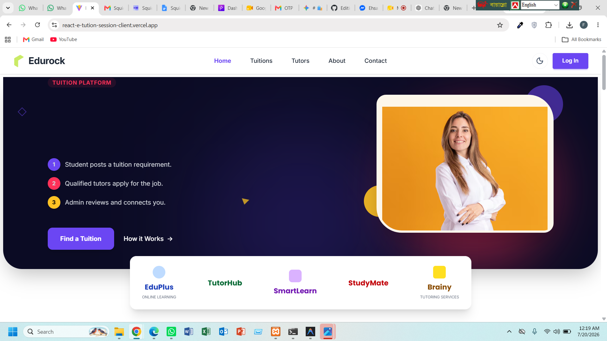

# 🎓 React E-Tuition Platform

React E-Tuition Platform is a full-stack MERN application that connects students with qualified tutors through a secure and user-friendly platform. Students can post tuition requests, tutors can apply for available jobs, and administrators can manage users and platform activities. The platform also integrates **Stripe** for secure online payments.

---

# 🌐 Live Demo

| Service | URL |
|----------|-----|
| **Frontend** | https://react-e-tution-session-client.vercel.app/ |
| **Backend API** | https://react-e-tution-session-sever.vercel.app/ |

---

# 📸 Preview



---

# ✨ Features

- 🔐 Firebase Authentication (Email & Password)
- 🔑 Google Sign-In
- 👤 Role-Based Dashboard (Student, Tutor & Admin)
- 📚 Post Tuition Requests
- 📝 Update & Delete Tuition Posts
- 🎯 Browse & Apply for Tuition Jobs
- 📄 Manage Applications
- 💳 Secure Stripe Payment Integration
- ⚡ TanStack Query for Efficient Data Fetching
- 🔍 Search & Filter Tuition Posts
- 📱 Fully Responsive Design
- 🌙 Modern UI with Tailwind CSS & DaisyUI
- 🔔 SweetAlert2 & React Hot Toast Notifications
- 🚀 REST API with Express.js & MongoDB

---

# 🛠️ Tech Stack

## Frontend

- React.js
- React Router DOM
- Vite
- Tailwind CSS
- DaisyUI
- Axios
- TanStack React Query
- Firebase Authentication
- Stripe
- SweetAlert2
- React Hot Toast
- React Icons

## Backend

- Node.js
- Express.js
- MongoDB
- Firebase Admin
- JWT Authentication
- Stripe API
- dotenv
- cors

## Deployment

- Frontend: Vercel
- Backend: Vercel

---

# 📦 Dependencies

## Frontend

```json
{
  "react": "^18.x",
  "react-dom": "^18.x",
  "react-router-dom": "^6.x",
  "@tanstack/react-query": "^5.x",
  "axios": "^1.x",
  "firebase": "^10.x",
  "@stripe/react-stripe-js": "^3.x",
  "@stripe/stripe-js": "^7.x",
  "react-hot-toast": "^2.x",
  "sweetalert2": "^11.x",
  "react-icons": "^5.x",
  "tailwindcss": "^3.x",
  "daisyui": "^4.x"
}
```

## Backend

```json
{
  "express": "^4.x",
  "mongodb": "^6.x",
  "firebase-admin": "^12.x",
  "jsonwebtoken": "^9.x",
  "stripe": "^17.x",
  "cors": "^2.x",
  "dotenv": "^16.x",
  "nodemon": "^3.x"
}
```

---

# 📂 Project Structure

```
react-e-tuition/
│
├── client/
│   ├── src/
│   ├── public/
│   ├── .env.local
│   └── package.json
│
├── server/
│   ├── routes/
│   ├── middleware/
│   ├── .env
│   ├── index.js
│   └── package.json
│
└── README.md
```

---

# ⚙️ Local Installation & Setup

## Prerequisites

Make sure the following are installed:

- Node.js (v18 or later)
- npm
- Git
- MongoDB Atlas Account
- Firebase Project
- Stripe Account

---

## 1️⃣ Clone the Repository

```bash
git clone https://github.com/rimi-1234/react-e-tuition-client.git
```

Move into the project folder:

```bash
cd react-e-tuition-client
```

---

# 🖥️ Backend Setup

## 2️⃣ Install Backend Dependencies

```bash
cd server
npm install
```

---

## 3️⃣ Create Backend Environment Variables

Create a file named:

```
server/.env
```

Add the following:

```env
PORT=5000

DB_USER=your_mongodb_username

DB_PASS=your_mongodb_password

ACCESS_TOKEN_SECRET=your_jwt_secret

STRIPE_SECRET_KEY=your_stripe_secret_key

CLIENT_URL=http://localhost:5173

FIREBASE_PROJECT_ID=your_project_id

FIREBASE_CLIENT_EMAIL=your_client_email

FIREBASE_PRIVATE_KEY=your_private_key
```

---

## 4️⃣ Run the Backend

Development mode:

```bash
npm run dev
```

or

```bash
npm start
```

Backend will run at:

```
http://localhost:5000
```

---

# 💻 Frontend Setup

## 5️⃣ Install Frontend Dependencies

```bash
cd client
npm install
```

---

## 6️⃣ Create Frontend Environment Variables

Create:

```
client/.env.local
```

Add:

```env
VITE_apiKey=your_firebase_api_key

VITE_authDomain=your_project.firebaseapp.com

VITE_projectId=your_project_id

VITE_storageBucket=your_project.appspot.com

VITE_messagingSenderId=your_sender_id

VITE_appId=your_app_id

VITE_API_URL=http://localhost:5000

VITE_STRIPE_PUBLIC_KEY=your_stripe_publishable_key
```

---

## 7️⃣ Run the Frontend

```bash
npm run dev
```

Open:

```
http://localhost:5173
```

---

# 🚀 Production Build

## Frontend

```bash
npm run build
```

Preview the production build:

```bash
npm run preview
```

## Backend

```bash
npm start
```

---

# 📜 Available Scripts

## Frontend

```bash
npm run dev
```

Start the development server.

```bash
npm run build
```

Build for production.

```bash
npm run preview
```

Preview production build.

```bash
npm run lint
```

Run ESLint.

---

## Backend

```bash
npm install
```

Install dependencies.

```bash
npm run dev
```

Run backend with nodemon.

```bash
npm start
```

Run production server.

---

# 👤 User Roles

## 🎓 Student

- Register/Login
- Post Tuition Jobs
- Update Tuition Posts
- Delete Tuition Posts
- View Applications
- Book Tutors
- Complete Payments

## 👨‍🏫 Tutor

- Browse Tuition Posts
- Filter by Subject & Class
- Apply for Tuition Jobs
- Manage Applications

## 👨‍💼 Admin

- Manage Users
- Verify Tutors
- Manage Tuition Posts
- Monitor Platform Activity

---

# 💳 Payment Integration

The application uses **Stripe** for secure online payments.

Features include:

- Secure Checkout
- Booking Confirmation
- BDT Currency Support
- Payment Verification

---

# 🌐 API Overview

| Method | Endpoint | Description |
|---------|----------|-------------|
| GET | `/tuition` | Get all tuition posts |
| GET | `/tuition/:id` | Get a single tuition |
| POST | `/tuition` | Create tuition |
| PATCH | `/tuition/:id` | Update tuition |
| DELETE | `/tuition/:id` | Delete tuition |
| POST | `/applications` | Apply for tuition |
| GET | `/users` | Get users |
| POST | `/create-payment-intent` | Stripe Payment |

---

# 🗄️ Database

MongoDB stores:

- Users
- Tutors
- Students
- Tuition Posts
- Applications
- Payments

---

# 🌍 Deployment

## Frontend

Deploy using **Vercel**.

```bash
vercel
```

## Backend

Deploy to **Vercel** or your preferred Node.js hosting provider after configuring the required environment variables.


---

# 🤝 Contributing

1. Fork the repository.

2. Create a feature branch.

```bash
git checkout -b feature-name
```

3. Commit your changes.

```bash
git commit -m "Added new feature"
```

4. Push your branch.

```bash
git push origin feature-name
```

5. Open a Pull Request.

---

# 📄 License

This project is licensed under the MIT License.

---

# 👨‍💻 Author

**Rimi**

GitHub: https://github.com/rimi-1234

---

# 🌐 Live Links

**Frontend:** https://react-e-tution-session-client.vercel.app/

**Backend:** https://react-e-tution-session-sever.vercel.app/
